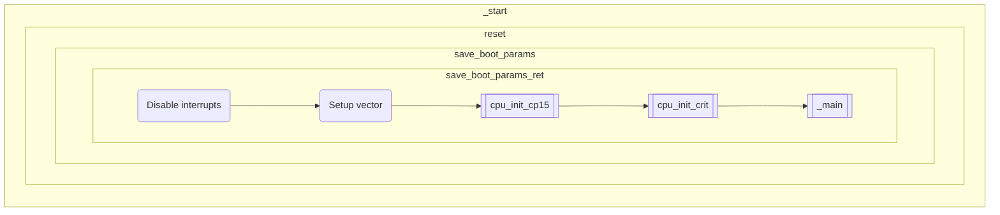

```mermaid
flowchart LR
subgraph _start
	subgraph reset
		subgraph save_boot_params
			subgraph save_boot_params_ret
				step_1(Disable interrupts)
				step_2(Setup vector)
				step_3[[cpu_init_cp15]]
				step_4[[cpu_init_crit]]
				step_5[[_main]]
				step_1 --> step_2 --> step_3 --> step_4 --> step_5
			end
		end
	end
end

```

| 函数            | 功能 |
| --------------- | ---- |
| `cpu_init_cp15` |      |

