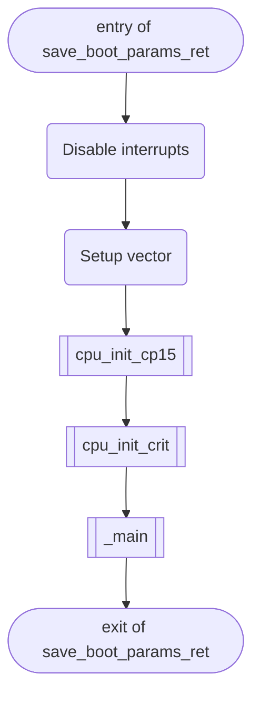

| 函数            | 功能                                     |
| --------------- | ---------------------------------------- |
| `cpu_init_cp15` | Setup CP15 registers (cache, MMU, TLBs). |
| `cpu_init_crit` | Setup important registers. |

> Q：如果我想了解 CP15 该去查找什么资料呢
> A：如果你想了解 CP15，可以查找 ARMv7-A 架构参考手册，其中包含了关于 CP15 寄存器的详细说明和操作方法。另外，你也可以查找相关的嵌入式系统开发书籍，比如《嵌入式系统实战开发》，其中也有涉及到 CP15 的介绍。

`cpu_init_crit`调用了`lowlevel_init`。


| Function           | Purpose |
| ------------------ | ------- |
| `board_init_f`     |         |
| `relocate_code`    |         |
| `relocate_vectors` |         |
| `board_init_r `| |

```mermaid

  


```

