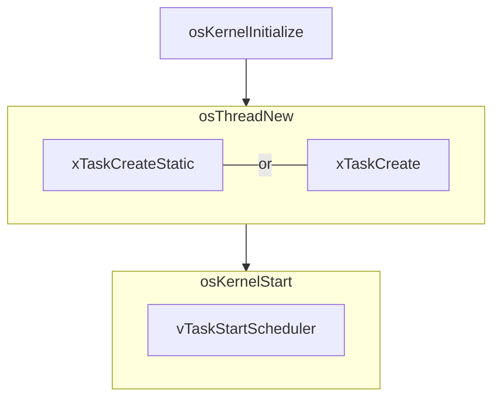

# CMSIS_RTOS2 初始化流程

```mermaid
flowchart TB
	osKernelInitialize
	
	subgraph osThreadNew
	xTaskCreateStatic--- |or|xTaskCreate
	end
	
	subgraph osKernelStart
	vTaskStartScheduler
	end
	
	osKernelInitialize --> osThreadNew --> osKernelStart
```

