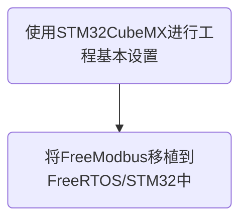

# 设计步骤

# 使用 STM32CubeMX 进行工程基本设置

根据电路原理图，使用 Crystal/Ceramic Resonator 作为 HSE 和 LSE 的来源，能够提高 4G 数传终端的稳定性。这种设置适用于那些需要高精度时钟和定时器的电子设备，以确保系统的准确性和稳定性。

将 Debug 设置为 Serial Wire，即使用 SWD 为调试接口，并将 TIM4 设置为 HAL 库的时基源。在这里不使用 Systick作为时基源的原因是，FreeRTOS 需要使用 SysTick 来提供定时器功能，以实现任务切换和延时等功能。因此，将TIM4 设置为时基源，避免了与 FreeRTOS 使用 SysTick 的冲突，并提高了系统的稳定性和调试效率。

开启 USART1，并将其模式设置为异步模式。我们使用 USART1 作为系统调试信息的打印接口，方便输出调试信息以及进行调试和故障排查。

启用 FreeRTOS，并将其接口设置为 CMSIS_V2。CMSIS_V2 是针对嵌入式系统开发的软件框架，提供标准接口和规范，帮助开发者配置、集成和移植软件到不同的嵌入式设备上。在使用 FreeRTOS 时，CMSIS_V2 可以作为一个抽象层，简化系统调用和资源管理，提高开发效率和可移植性。

配置时钟树的主要步骤包括将 PLL 时钟源从 HSI 切换为 HSE，将系统时钟从 HSI 切换为 PLLCLK。这样设置可以提高系统时钟的精度和稳定性，以满足4G数传终端对高精度时钟和定时器的要求。

选择 MDK-ARM 作为开发工具，生成代码。这一步是进入具体的编码实现前的准备工作，确保所选的IDE 可以支持我们的开发需求，并生成适合的代码框架。

# 将 freemodbus 移植到 FreeRTOS/STM32 中

FreeModbus 是一款开源的 Modbus 协议栈，支持从机模式，但主机模式需要收费获取源码。缺少好的开源 Modbus主机协议栈，因此选择 RT-Thread 团队维护的 freemodbus 版本，它具有 TCP 模式、RTU 模式等丰富特性。

将[RT-Thread-packages](https://github.com/RT-Thread-packages)/**[freemodbus](https://github.com/RT-Thread-packages/freemodbus)**仓库拉取下后，首先关注 port 文件夹，其中 port 开头的文件，即为移植所要实现的文件。首先在 `port.h`中内包含`cmsis_os.h`文件，来使用 CMSIS_RTOS2 提供的实时操作系统接口。

